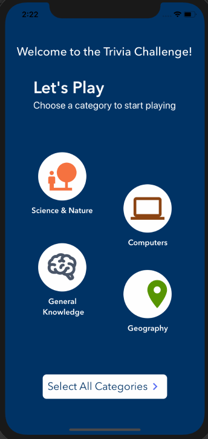
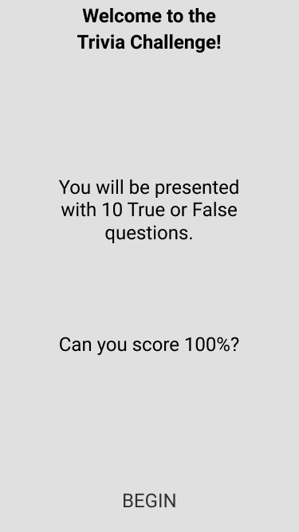
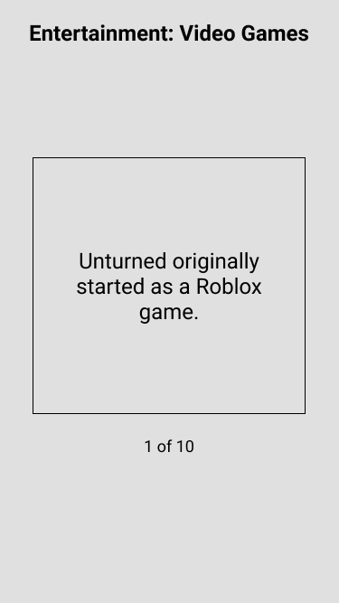
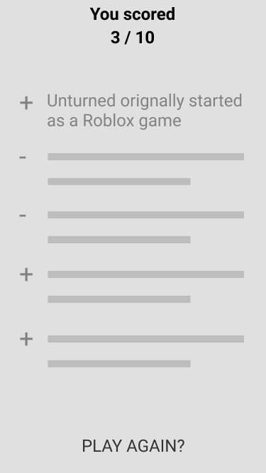

# Trivia Game Coding Challenge



## Overview

Your challenge is to create a simple, 10 question, true or false, trivia app in the technology you are applying to work in. While the problem you are working on is simple, you should treat this like a real world application. This is a chance to show off your abilities and impress.

**The application code will be reviewed and scored on these key areas with many subset areas for each:**

* Functionality
* Code Quality
* Project Structure
* Scalability
* Maintainability
* UI/UX
* Use of industry best practices

## Goals

Implement the screens based off the wireframes and api below using advanced techniques and industry best practices for your platform. Note that the wireframes may not be complete, so use your best judgment for UI/UX implementation.

## Specifications

Data:

The api url is: https://opentdb.com/api.php?amount=10&difficulty=hard&type=boolean

API DOCS: https://opentdb.com/api_config.php
Use only `type=boolean` (True/False)

Sample returned json:

```javascript
{
  "response_code": 0,
  "results": [
    {
      "category": "Entertainment: Video Games",
      "type": "boolean",
      "difficulty": "hard",
      "question": "Unturned originally started as a Roblox game.",
      "correct_answer": "True",
      "incorrect_answers": [
        "False"
      ]
    },…]}
```

### Intro / Home Screen:



* Static Text
* BEGIN button navigates to the Quiz screen and starts the Quiz

### Quiz Screen:



* The headline is from question category
* The card element contains the current question
* The next question should appear after the current question is answered True or False
* After all questions have been answered, navigate to the Results Screen

### Results screen:



* The Score shows correct and total
* Displays a list of the questions and whether the answer was correct or not
* PLAY AGAIN starts over and navigates to the Home Screen

## Bonus points
### Category selector & Difficulty selector
  Before starting a new game, enhance the UI by adding a category & difficulty selector.
  - Defaults:
    - Category: All categories
    - Difficulty: Easy
### Animations
  Use of micro-interactions and UI Animations to create a better User Experience.


## Outstanding tasks

### Question timer
  Create an algorithm that will determine the minimum amount of time that will take for a user to give an answer.

  This should take into consideration the difficulty, question words count and reading time.

  If the timer exceeded, the question will be marked as wrong and the program will move to the next question or end the quiz if it's the last questio.

### Rewards & Points mechanism
  Create an algorithm that will give different rewards and points for each question. It's up to you to decide how the rewards and points are given.

  At the end of the game share the rewards and points with the user.

  Game finished animation inspiration example: https://github.com/catalinmiron/react-native-tap-tile-game

### Firebase integration
- Authentication & Database
  - Login user as anonymous and store his session into the database
  - Store user points and rewards into the database.

### Leaderboard
- Show user's achievements and where is he situated in the hierarchy

## What we're looking for?

We know that technical details matters and you have free hand on choosing the right tools, boilerplates and libraries, but we expect more from you:
- keep an eye on design and UI elements
- animations 
- micro-interactions

*Use your best judgment for UI/UX implementation and UI animations.*

Below you can find some inspiration, but we would like to see this type of animations being implemented: https://dribbble.com/shots/2926913--4-Compound-Questionnaire and https://dribbble.com/shots/3312677-Inspection-UI-Freebie. 

# Extra 100 points

This design and animation might not fit into this challenge type but you'll gain **100 points** if you'll be able to implement it. 
Take a look at it: https://dribbble.com/shots/3058022--10-Vertical-Distribution, we call it double menu or menu distribution.
We would like to see how you approach this type of animation and how you'll be able to achieve it. 

You can use any existing library but the final result should be as close as the one from the link.


#### UI Inspiration

- https://dribbble.com/shots/3312677-Inspection-UI-Freebie
- https://dribbble.com/shots/2926913--4-Compound-Questionnaire
- https://dribbble.com/shots/13969288-Day-15-of-100-Quiz-App-Concept
- https://dribbble.com/shots/11295344-Quiz-App-UI
- https://dribbble.com/shots/14012432-Quiz-App-Mobile-Design
- https://dribbble.com/shots/6209755-Trivia-Question
- https://dribbble.com/shots/5453056-Famelab-Leaderboard-Interaction
